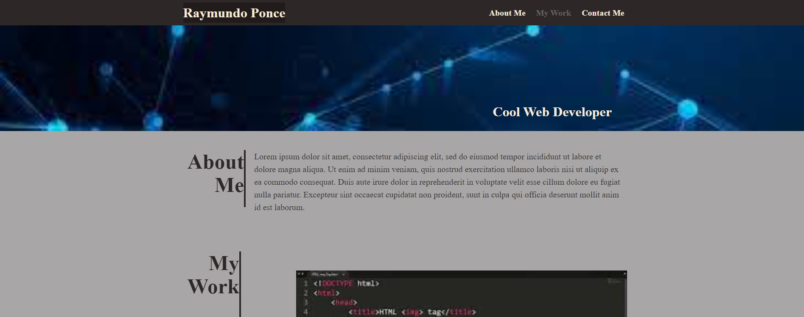
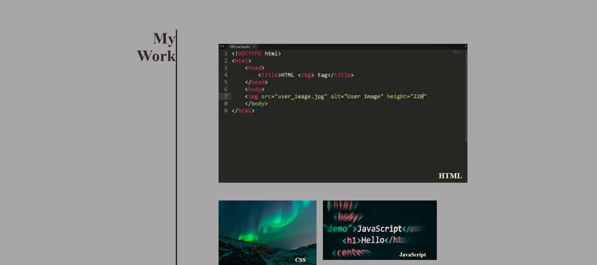
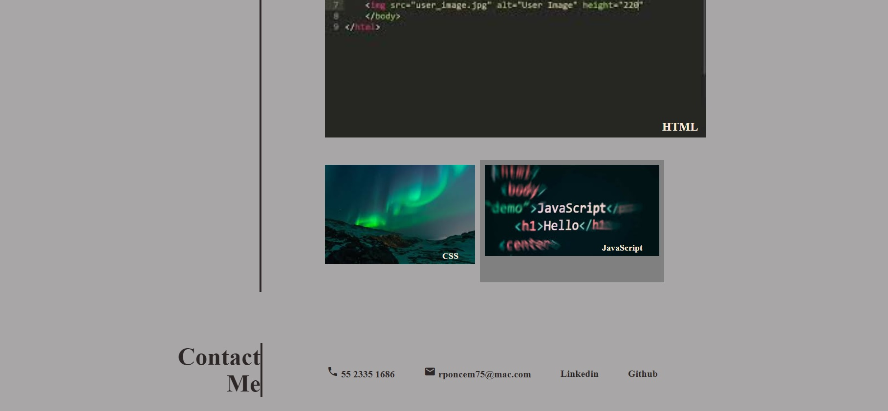

# Challenge 2 - Advance CSS

## Description

This is the Challenge 2, I created a webpage with HTML and CSS according to the guidelines of the Challenge 2of the Bootcamp.
This challenge took me time to solve it sinve it was the first time I applied CSS to an HTML file.
I learnt how to use CSS and specially I learnt how to use Flexbox, it is a great tool once you get acquainted to it.
The challenge has the NavBar, the Header, About me (I used a generic paragraph), My work (linked to the projects I have done recently) and the contact info.

## Installation

N/A

## Usage

N/A

## Credits

N/A

## License

N/A

## Images

